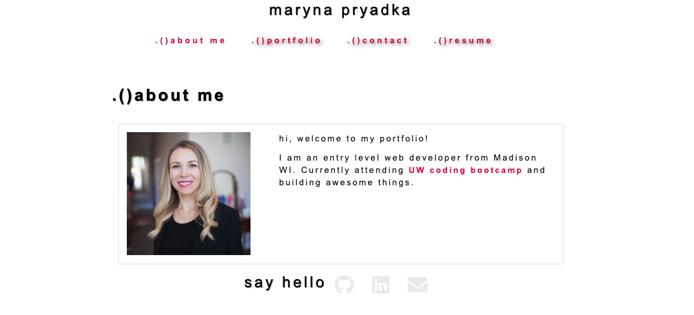

# react-portfolio

 [Live Site on GithubPages](https://marynapr.github.io/react-portfolio/) / [Github Repo](https://github.com/MarynaPR/react-portfolio)
### description :page_with_curl:

Welcome to my portfolio created using React. This applicaton showcases some featured projects built through the University of Wisconsin Extended Campus Coding Bootcamp and presents an apportunity to share my work with fellow developers and collaborate on future projects. 
* `light/dark mode` feature activated.

### screenshots :camera_flash:

### badges/technologies :label: 

        

### resources used :wrench: 

* [react documentation](https://reactjs.org/)
* [deployment](https://facebook.github.io/create-react-app/docs/deployment)
* [create react app](https://github.com/facebook/create-react-app)
* [deployment](https://facebook.github.io/create-react-app/docs/deployment) 
* [react-bootstrap](https://react-bootstrap.github.io/getting-started/introduction)
* [switch](https://developer.mozilla.org/en-US/docs/Web/JavaScript/Reference/Statements/switch)
* [git branch](https://cmatskas.com/delete-git-branch-locally-and-remotely/)
* [coolors](https://coolors.co/)
* [colorhunt](https://colorhunt.co/)
* [mdbreact](https://mdbootstrap.com/docs/react/getting-started/quick-start/)
* [dark mode](https://github.com/donavon/use-dark-mode)
* [react photo gallery](https://www.npmjs.com/package/react-photo-gallery)
* [emoji-cheat-sheet:for readme](https://github.com/ikatyang/emoji-cheat-sheet)
* * [10 Fantastic Portfolio Websites from Silicon Valley Design Leads](https://bestfolios.medium.com/10-fantastic-portfolio-websites-from-silicon-valley-design-leads-2d84b384dba6)
* * [1page-portfolio](https://onepagelove.com/inspiration/portfolio)
* * [10 Awesome Web Developer Portfolios](https://codeburst.io/10-awesome-web-developer-portfolios-d266b32e6154)
*  try `extension EX7`-`rfce` in VS code

### installation :electric_plug:

* download files from this repo
* install necessary dependencies with `npm install`
* run `npm start` at the root of the directory to connect to the server

### contribution :heavy_plus_sign: 

Contributions, [issues](https://github.com/MarynaPR/react-portfolio/issues) and feature requests are welcome! Please follow the [Standard Contributor Covenant](https://www.contributor-covenant.org/) when looking to make any additions to this project. 
Give :star: if you found this project useful. 

### questions :question: 
Feel free to contact me with any questions via email: [:e-mail:](pryadkamaryna@gmail.com)
If you'd like to see my other projects, please visit my :octocat: 
[GitHub](https://github.com/MarynaPR?tab=repositories)